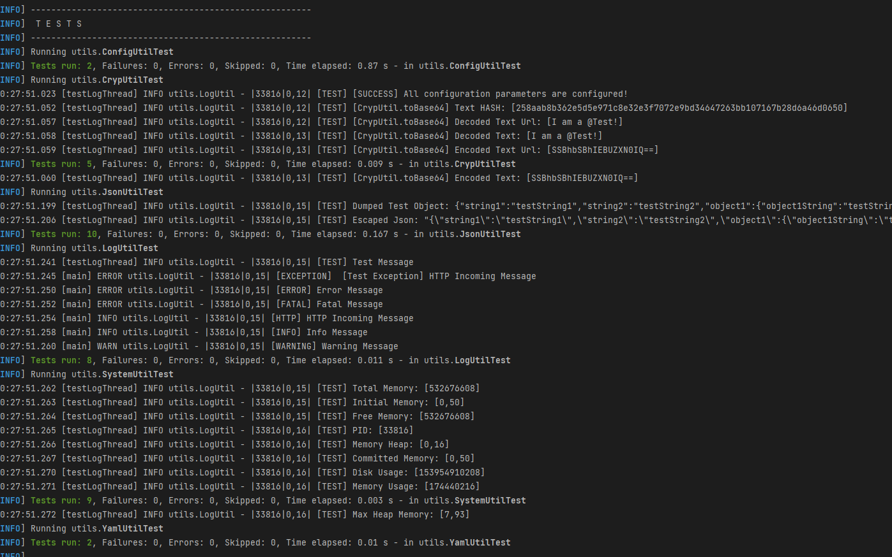

#  Product Battery Passport Consumer Backend

## What is this backend app responsible for?

This backend includes the services and *logics* to manage the *passports* of the `frontend app`.

## Services Available

### Authentication Services

For login and log out!
```bash
\auth\login
------
\auth\check #With this api you can check you authentication status.
------
\auth\logout
------
\auth #Calling this api will redirect you to \auth\login
```

### API Services

#### Data
At the moment api services are just implemented for testing.
```bash
\api\data\catalog?providerUrl=<...> #Get all the catalog from the provider

------
\api\data\submodel\<assetId>?idType=<...>&index=<...>
__________
default idType = "Battery_ID_DMC_Code"
default index = 0

------

```
>  **_NOTE:_** You must be authenticated with the keycloak instance to access this APIs

#### Contracts
You can search for contracts using the assetId from the product


You can also get all the contracts available:

### Public APIs

Public APIs don't require authentication
```bash
\health #Get the health status of the server
```
```json
{
    "message": "RUNNING",
    "status": 200,
    "statusText": "Success",
    "data": "24/11/2022 17:48:18.487"
}

```
## Run the application

Use maven to run the spring boot application indicating the environment:
```bash
mvn spring-boot:run -Dspring-boot.run.profiles=<environmentCode>
```


### Available Environments
By default the application will start in development environment:
#### Development Environment
For the development environment include the following code:
```yaml
environmentCode: dev
```
#### Integration Environment
For the integration environment include the following code:
```yaml
environmentCode: int
```


#### Configuration of Environment
To configure the environment go to the following file ```src/main/resources/config/env.yml```
```yaml
environment: "int" # If empty will be selected the default environment

default:
  environment: "dev" # Default environment
  available: #Available environments
    - "dev"
    - "int"

```
#### Adding a new Environment
Let imagine you want to add the following environment code: `newEnvironmentCode`

> **_NOTE:_**: Environment codes **must** not have _spaces_ or _special characters_!

1. When a new environment is at the available list, a configuration file must be defined and added in the ```src/main/resources/application.yml```:

```yaml
spring:
  config:
    import: "application-dev.yml"

---

spring:
  config:
    activate:
      on-profile: "int"
    import: "application-int.yml"

---

spring:
    config:
        activate:
            on-profile: "<newEnvironmentCode>"
        import: "application-newEnvironmentCode.yml"

```

2. Add the following environmentCode to the ```src/main/resources/config/env.yml```

```yaml
default:
  environment: "dev" # Default environment
  available: #Available environments
    - "dev"
    - "int"
    - "newEnvironmentCode"
```

3. Configure the following files
   - Vault File:  `data/VaultConfig/vault.token-newEnvironmentCode.yml`
   - Application Configuration File: `src/main/resources/config/configuration-dev.yml`
   - Spring Boot Configuration File: `src/main/resources/application-dev.yml`

## License
[Apache-2.0](https://raw.githubusercontent.com/catenax-ng/product-battery-passport-consumer-app/main/LICENSE)
