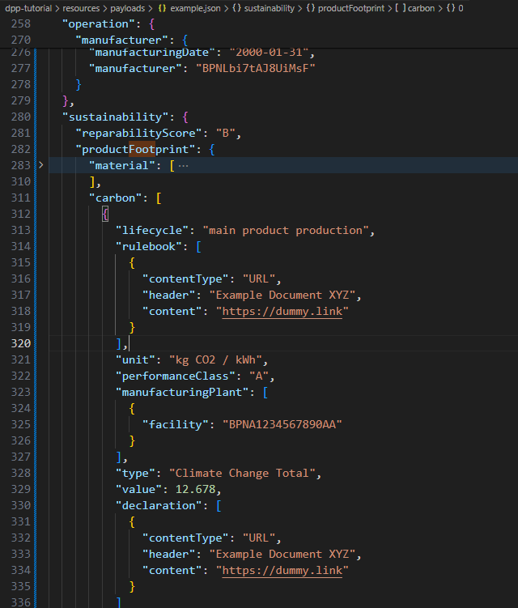

<!--
#######################################################################

Tractus-X - Digital Product Pass Application 

Copyright (c) 2024 BMW AG
Copyright (c) 2024 CGI Deutschland B.V. & Co. KG
Copyright (c) 2024 Contributors to the Eclipse Foundation

See the NOTICE file(s) distributed with this work for additional
information regarding copyright ownership.

This work is made available under the terms of the
Creative Commons Attribution 4.0 International (CC-BY-4.0) license,
which is available at
https://creativecommons.org/licenses/by/4.0/legalcode.

SPDX-License-Identifier: CC-BY-4.0

#######################################################################
-->

# DPP Instance Aspect Model Creation Guide

This guide provides a simple explanation on how to create a digital product pass serialized aspect model payload.

## Prerequisites

You must fullfill the following pre-requisites:

- A Catena-X Standarized Aspect Model (in this case we use the [Digital Product Pass v5.0.0 Model](https://github.com/eclipse-tractusx/sldt-semantic-models/tree/main/io.catenax.generic.digital_product_passport/5.0.0))
- JSON Editor like [VS Code](https://code.visualstudio.com/) or [Notepad++](https://notepad-plus-plus.org/downloads/)
- Car Parts JSON Test Data [found here](./resources/test-data/carParts.json)

>[!WARNING]
>
> The model v2.0.0 of the Digital Product Pass is **DEPRECATED** and its used here only as demo purposes, please check the latests models in: [Digital Product Pass Models](https://github.com/eclipse-tractusx/sldt-semantic-modelstree/main/io.catenax.generic.digital_product_passport)


## Aspect Model Creation

Follow this steps to create a new Digital Product Passport serialized model:

### 1º - Find test data before generating the model

In the worksession you will receive a paper with the test data, you can find the same information [here](./resources/test-data/carParts.json) in a tes JSON file.

To find your part and be able to copy and paste the information:

1 - Search by uuid with CTRL + F:


You will get your information in a paper:

Example:

```json
{
 "f10c0181-ce80-4139-81f0-a59226c88bfe": {
      "Name":"TRUNK LID HINGE (LEFT)",
      "PCF (Product Carbon Footprint)": "189 kgCO2e",
      "Height": "24 cm",
      "Width": "2 cm",
      "Length": "38 cm",
      "Weight": "1.4 kg",
      "id": "f10c0181-ce80-4139-81f0-a59226c88bfe",
      "Part Instance ID": "DLH-5159",
      "Manufacturing Date": "01.12.2023",
      "Placed on Market Date": "15.01.2024",
      "List of Materials": "Aluminum",
      "Hazard Materials": "Lead, Butyl, Cyanoacrylates, Polyurethane",
      "Guarantee": "24 months"
  }
}

```

> [!TIP]
> Copy and paste the data for creating your digital product pass faster!


### 2º - Copy the digital product pass aspect model template into a new file or window

Paste this [Digital Product Passport v5.0.0 Payload](./resources/payloads/example.json) in the VS Code/Notepad++:


It is a test data template that can be personalized to your part with the test data provider to you and your creativity!

### 3º - Substitute data in the template

For example for adding the PCF value follow the following path:

```text
sustainability.productFootprint.carbon[0].value
```

Example:



#### Where to substitute the data?

Follow this paths to find where the information is located.

| Property | Path |
| -------- | ----- |
| Name (Really short) | identification.type.nameAtManufacturer |
| Class/Type of Part | identification.classification.classificationDescription |
| PCF | sustainability.productFootprint.carbon[0].value |
|Height| characteristics.physicalDimension.height.value |
|Width| characteristics.physicalDimension.width.value|
|Length| characteristics.physicalDimension.length.value|
|Weight| characteristics.physicalDimension.grossWeight.value|
|Part Instance Id | identification.serial[0].value |
|Manufacturing Date |operation.manufacturer.manufacturingDate |
| Guarantee | lifespan[0].value (Add value) |
| Guarantee | lifespan[0].unit (Add unit:months) |

Congratulations! You have successfully created your own digital product pass!

The next step will be to register your data in a Data Service, for that follow the [digital-twin-provision](./digital-twin-provision.md) guide.

> [!TIP]
> You can add more relavant data and personalized information at the digital product pass, follow the template and modify the data as you wish!

## NOTICE

This work is licensed under the [CC-BY-4.0](https://creativecommons.org/licenses/by/4.0/legalcode).

- SPDX-License-Identifier: CC-BY-4.0
- SPDX-FileCopyrightText: 2024 BMW AG
- SPDX-FileCopyrightText: 2024 CGI Deutschland B.V. & Co. KG
- SPDX-FileCopyrightText: 2024 Contributors to the Eclipse Foundation
- Source URL: https://github.com/eclipse-tractusx/digital-product-pass
